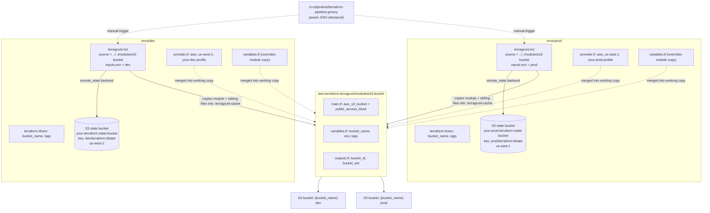

## Terraform + Terragrunt AWS Multi-Env S3

A small Terragrunt setup that provisions a private S3 bucket in two AWS environments, dev and prod, from a single Terraform module. The point of the repo is the layering, not the resource: one `s3-bucket` module gets reused per environment with its own AWS region, remote state location, and tags, without copy-pasting the `.tf` files themselves.

There's no application workload here. This is infrastructure-as-code scaffolding you'd extend with more modules (VPC, IAM, whatever) once the environment/state pattern is in place.

## Architecture



Terragrunt is doing one real job here: each `envs/<name>/terragrunt.hcl` sets `source = "../../modules/s3-bucket"`, and at `terragrunt init` time it downloads that module into `.terragrunt-cache/` and copies every other file sitting next to the `terragrunt.hcl` (`provider.tf`, `variables.tf`) into the same working directory before running Terraform. That's why the AWS provider block and region live per-environment instead of inside the module, and why I didn't need two copies of `main.tf`. I checked this by running `terragrunt init` against `envs/dev` and inspecting `.terragrunt-cache`: the per-env `variables.tf` silently overwrites the module's own `variables.tf` (same filename, same directory) because it declares the same three variables with a stricter type on `env`. It works, but it's an implicit override by filename collision rather than something you'd notice reading the module in isolation — a `generate` block would have made the intent explicit.

Plain Terraform could do this too with `-backend-config` flags and a `terraform.tfvars` per environment, but you'd be hand-running `init -reconfigure` every time you switched environments and there's no single place enforcing that dev and prod use the same module version. Terragrunt's `remote_state` block generates the backend config from HCL instead of a separate `-backend-config` file, and `inputs` passes `env` into the module without it needing to live in a tracked `.tfvars` file. What this repo does not do is use a root `terragrunt.hcl` with an `include` block — each environment's `remote_state` block is typed out by hand (bucket, key, region, encrypt repeated twice), so the "DRY" story only covers the module, not the backend/provider wiring. A root config with `path_relative_to_include()` deriving the state key would remove that duplication; I left it as-is rather than restructuring the layout for a two-environment repo.

## Project structure

```
.
├── README.md
├── SECURITY.md
├── script.sh                          # scaffolds the directory/file skeleton (touch, not codegen)
├── validate.sh                        # local sanity checks: tool versions, placeholder values, terragrunt-info
└── aws-terraform-terragrunt/
    ├── ci-cd/
    │   └── jenkins/
    │       └── terraform-pipeline.groovy   # declarative pipeline, ENV param (dev/prod), not wired to a live Jenkins job
    ├── envs/
    │   ├── dev/
    │   │   ├── backend.hcl              # same values as the remote_state block below, kept for validate.sh's grep checks
    │   │   ├── provider.tf              # aws provider, us-west-2, profile placeholder
    │   │   ├── terraform.tfvars.example
    │   │   ├── terragrunt.hcl           # source, remote_state, inputs.env = "dev"
    │   │   └── variables.tf
    │   └── prod/
    │       ├── backend.hcl
    │       ├── provider.tf              # aws provider, us-east-1, profile placeholder
    │       ├── terraform.tfvars.example
    │       ├── terragrunt.hcl           # source, remote_state, inputs.env = "prod"
    │       └── variables.tf
    └── modules/
        └── s3-bucket/
            ├── main.tf                  # aws_s3_bucket + aws_s3_bucket_public_access_block
            ├── outputs.tf                # bucket_id, bucket_arn
            └── variables.tf
```

There's no `staging` environment despite that being the common third leg of this pattern — it's just dev and prod.

## How to run this

You need Terraform 1.10+, Terragrunt, an AWS CLI profile, and an S3 bucket that already exists for state storage (this repo doesn't bootstrap its own backend bucket).

```bash
cd aws-terraform-terragrunt/envs/dev
cp terraform.tfvars.example terraform.tfvars   # fill in bucket_name and tags
# edit provider.tf to point at a real AWS profile instead of your-dev-profile
# edit terragrunt.hcl / backend.hcl to point at a real state bucket instead of your-terraform-state-bucket

terragrunt init
terragrunt plan
terragrunt apply
```

Same steps from `aws-terraform-terragrunt/envs/prod`, with the `us-east-1` region and prod placeholders.

To plan both environments in one shot, run from the `envs/` directory:

```bash
cd aws-terraform-terragrunt/envs
terragrunt run-all plan
```

`run-all` discovers every `terragrunt.hcl` under the current directory and works here even without a root config, since dev and prod don't depend on each other.

## Known gaps

- **No root `terragrunt.hcl`.** Each environment repeats its own `remote_state` block by hand instead of inheriting one through `include`. Fine for two environments, would get annoying at five.
- **No provider version pinning.** There's no `required_providers` block anywhere, so `terraform init` pulls whatever the latest AWS provider is. The module sets `acl = "private"` directly on `aws_s3_bucket`, which is deprecated behavior removed in newer provider major versions — on a fresh install this may need a separate `aws_s3_bucket_acl` resource to actually apply.
- **`backend.hcl` files aren't used by Terraform or Terragrunt.** The `remote_state` block in each `terragrunt.hcl` already generates the backend config; `backend.hcl` duplicates the same values and is only read by `validate.sh`'s grep checks. Two places to update if a bucket name changes.
- **Everything is a placeholder.** `your-dev-profile`, `your-terraform-state-bucket`, `your-prod-profile`, and the repository URL in the Jenkins pipeline all need manual substitution before anything in this repo runs. There's no bootstrap script that creates the state bucket itself.
- **No CI pipeline in this repo.** `terraform-pipeline.groovy` is a Jenkinsfile you'd point a Jenkins job at, but there's no Jenkins instance, GitHub Actions workflow, or any automation actually running plan/apply from a push in this repository.
- **No automated tests.** `validate.sh` is a manual script (tool versions, placeholder greps, `terragrunt-info`) you run yourself; there's no Terratest, no `terraform validate` in CI, nothing that runs unattended.
- **State locking depends on Terraform's native S3 lockfile (`use_lockfile = true`)**, not a DynamoDB table. That needs Terraform 1.10+; older Terraform versions expecting a lock table won't work against this backend config as written.
- **README previously referenced a LICENSE file that doesn't exist in this repo.** No license is currently declared.
